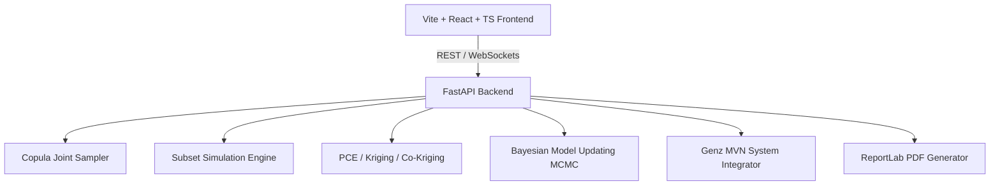

# Reliability-Lab Architecture Overview

## System Architecture

### Core Components
1. **`sampling/`**: Copula joint distributions (Gaussian, Clayton, Gumbel), limit-state evaluator $g(\mathbf{X})$, and rare-event estimators (Subset Simulation, Adaptive Importance Sampling).
2. **`surrogates/`**: Polynomial Chaos Expansion (Legendre/Hermite), Kriging Gaussian Processes with Active Learning via Expected Feasibility Function (EFF), and Multi-Fidelity Co-Kriging.
3. **`bayes/`**: Streaming Bayesian model updating via MCMC.
4. **`system/`**: Time-variant reliability degradation $\beta(t)$ & Genz MVN integration for series/parallel/cut-set system block diagrams.
5. **`report/`**: PDF report generation with full numerical provenance.
